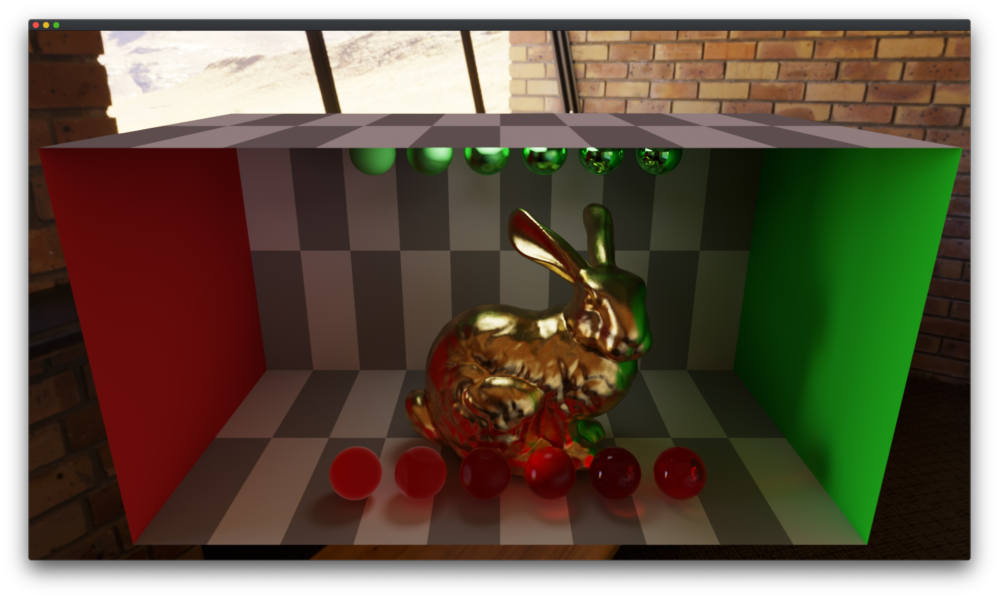
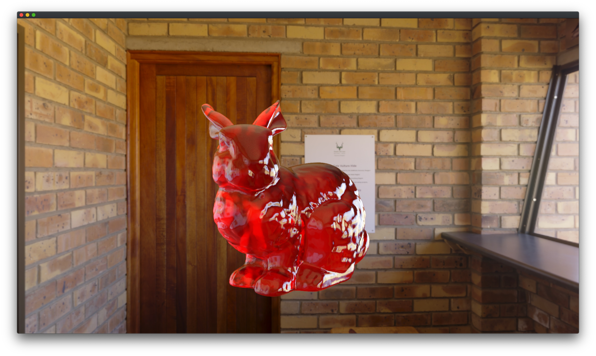
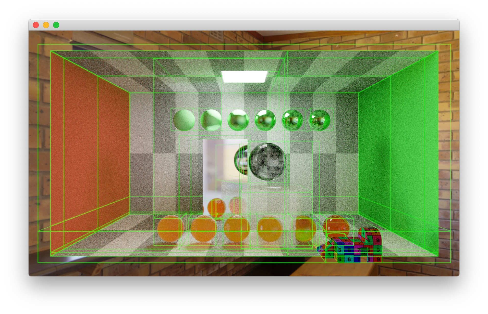

# Tracer
This is simply a repository for my **Ray Tracing** code.

### Bigger things to-do:
- [x] [Ray Tracing: In One Weekend](https://raytracing.github.io/books/RayTracingInOneWeekend.html)
- [x] [Ray Tracing: The Next Week](https://raytracing.github.io/books/RayTracingTheNextWeek.html)
- [x] [Ray Tracing: The Rest of Your Life](https://raytracing.github.io/books/RayTracingTheRestOfYourLife.html)
- [ ] [Metal Kernel](https://developer.apple.com/documentation/metal)
    - [ ] Spatiotemporal Variance-Guided Filtering
    - [ ] MPS Acceleration & Denoise
    - [x] Stackless BVH backtrace on GPU
    - [x] pcg-random
    - [x] GGX & PBR
- [ ] [**Physically Based Rendering** __*third edition*__](http://www.pbr-book.org/)
    - [x] Sobol’ Sampler
    - [x] ***BVH*** Surface Area Heuristic
    - [x] Oren-Nayar Diffuse
    - [x] TrowbridgeReitz Distribution
    - [ ] Multiple importance sampling
    - [ ] Volume Rendering
    - [ ] Stochastic Progressive Photon Mapping
    - [ ] Metropolis Light Transport
   
- [ ] [TU Wien Rendering](https://www.cg.tuwien.ac.at/courses/Rendering/VU.SS2020.html)
- [ ] [Ray Tracing Gems](https://www.realtimerendering.com/raytracinggems/)

### Small things to-do:
- [x] Basic GUI & Menu
- [ ] Pretty GUI 
- [ ] Copy to pasteboard
- [ ] Export as PNG file
- [ ] Cancelable tasks 
- [x] Camera control

### Problems
- Using too many SIMD commands could block the main thread.
- Inconsistent Metal shader running results on AMD and Intel GPU.

