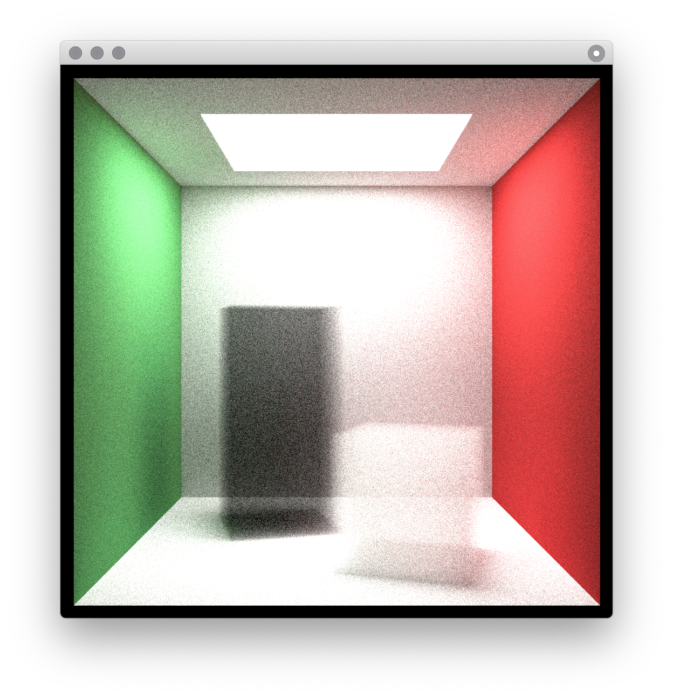
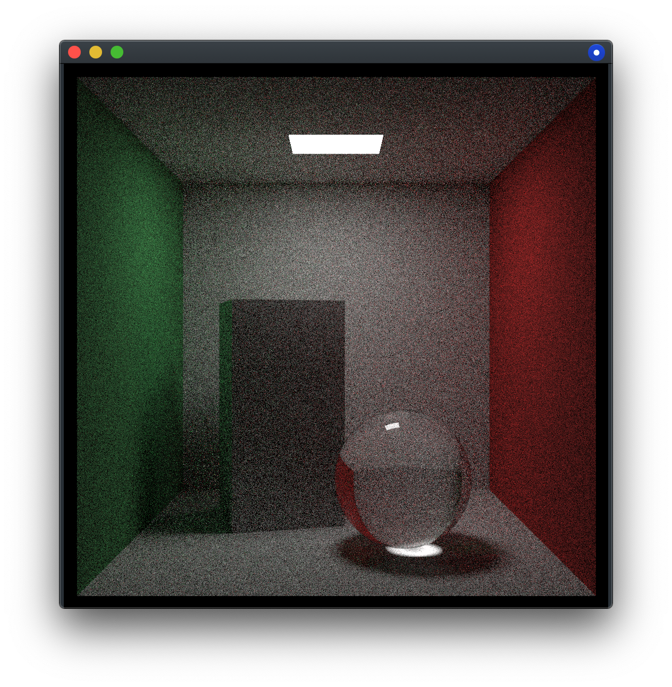

# Tracer
This is simply a repository for any **Ray Tracing** code written by me. Currently, it only contains **Swift** code for the three mini books on **Ray Tracing**. Many people don't do the third book, because the concept of Monte Carlo method is not well explained it. As the follow up, I am going to read PBRT after doing some Metal GPU coding. 

256 *`SPP`* 1024x1024 *`Basic`*  | 512 *`SPP`* 1024x1024 *`Monte Carlo`*
:---:|:---:
 | 

### Why do I use Swift for Ray Tracing?
- If I write the same C++ code from the books, I may forgot the concepts and logics very quickly. Using a different language will push my brain to work, and I will remember longer. 
- I am considering switching to C++ & Objective-C, because most Swift types cannot been used in metal shader directly. If you want to use both Swift & Metal, there will be alot redundant work rewriting the code. That will be a nigtmare if I am doing a GPU version of PBRT.

### Bigger things to-do:
- [x] [Ray Tracing: In One Weekend](https://raytracing.github.io/books/RayTracingInOneWeekend.html)
- [x] [Ray Tracing: The Next Week](https://raytracing.github.io/books/RayTracingTheNextWeek.html)
- [x] [Ray Tracing: The Rest of Your Life](https://raytracing.github.io/books/RayTracingTheRestOfYourLife.html)
- [ ] [Metal API](https://developer.apple.com/documentation/metal)
- [ ] [**Physically Based Rendering** __*third edition*__](http://www.pbr-book.org/)
    - [ ] Volume Rendering
    - [ ] Metropolis Light Transport
   
- [ ] [TU Wien Rendering](https://www.cg.tuwien.ac.at/courses/Rendering/VU.SS2020.html)
- [ ] [Ray Tracing Gems](https://www.realtimerendering.com/raytracinggems/)

### Small things to-do:
- [x] Basic GUI & Menu
- [ ] Pretty GUI 
- [ ] Copy to pasteboard
- [ ] Export as PNG file
- [ ] Cancelable tasks 
- [ ] Camera control

### Problems
- Using too many SIMD commands could block the main thread.
- Sometimes, memory costing is high when launching the app.
