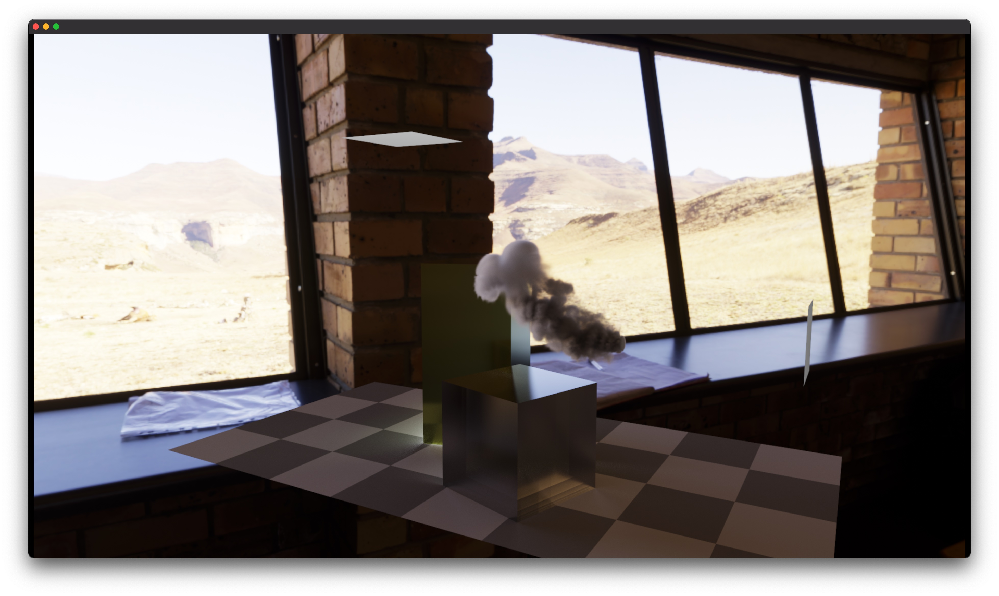

# Lǐ - PBRT on Metal
This is simply a repository for my **Ray Tracing** code.

# Requirement
RT_Metal requires `Metal 2 Tier 2` device, typically any AMD dGPU & eGPU woking on macOS. However, I only tested with my device, it's not guaranteed to work with yours. Not tested for M1, it may require some minor modification to source code.

The deplyment target is macOS 11, but it should work on Catalina and Mojave. I am avoiding using new APIs added after 2019, case Apple is narrowing down new APIs support on old devices.

|  |  |
|:---------------------------:|:---------------------------:|
|  |  |

### Features:
- [ ] [Metal Kernel](https://developer.apple.com/documentation/metal)
    - [ ] MPS Acceleration & SVGF Denoise
    - [x] Stackless BVH backtrace on GPU
    - [x] Bindless resources
    - [x] pcg-random
- [ ] [**Physically Based Rendering,** __*Third Edition*__](http://www.pbr-book.org/)
    - [ ] Halton Sampler
    - [x] Sobol’ Sampler
    - [ ] ***BVH*** 
        - [x] Surface Area Heuristic
        - [ ] LBVHs, Morton Encoding
    - [x] Microfacet
        - [x] Beckmann
        - [x] TrowbridgeReitz
    - [x] Multiple importance sampling
    - [ ] Ray Differential
    - [ ] Volume Rendering
        - [x] Homogeneous Medium
        - [x] Heterogeneous Medium
        - [ ] BSSRDF
    - [ ] Stochastic Progressive Photon Mapping
    - [ ] Bidirectional Path Tracing
    - [ ] Metropolis Light Transport
    - [ ] Support pbrt-v3 file format 

### Other things to-do:
- [ ] Basic GUI & Menu
- [ ] Export as PNG file
- [ ] Cancelable tasks 
- [x] Quaternion camera

 ### References:  
- [ ] [Ray Tracing Gems](https://www.realtimerendering.com/raytracinggems/)
- [ ] [TU Wien Rendering](https://www.cg.tuwien.ac.at/courses/Rendering/VU.SS2020.html)
- [ ] [Dartmouth Rendering Algorithms](https://cs87-dartmouth.github.io/syllabus/)
- [x] [Ray Tracing mini books by Peter Shirley](https://raytracing.github.io/)
- [ ] [Eric Veach, Ph.D. dissertation, December 1997](http://graphics.stanford.edu/papers/veach_thesis/)