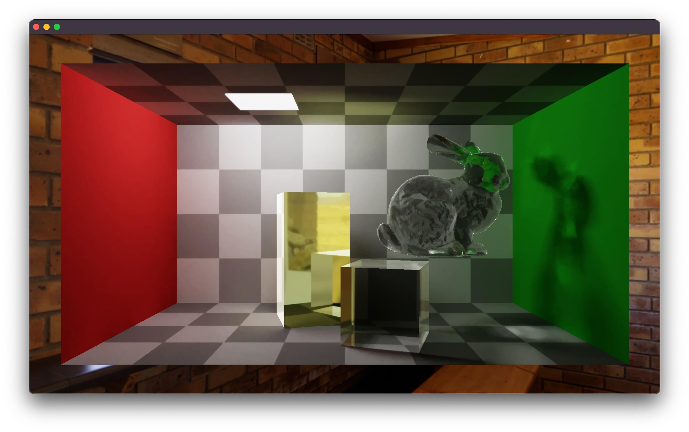
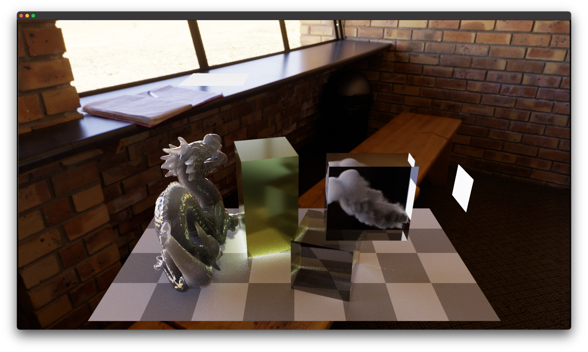
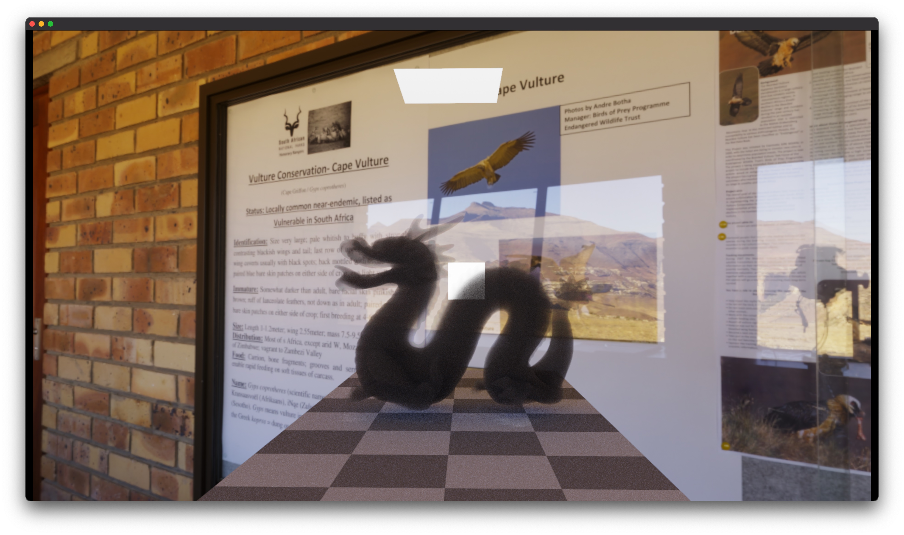
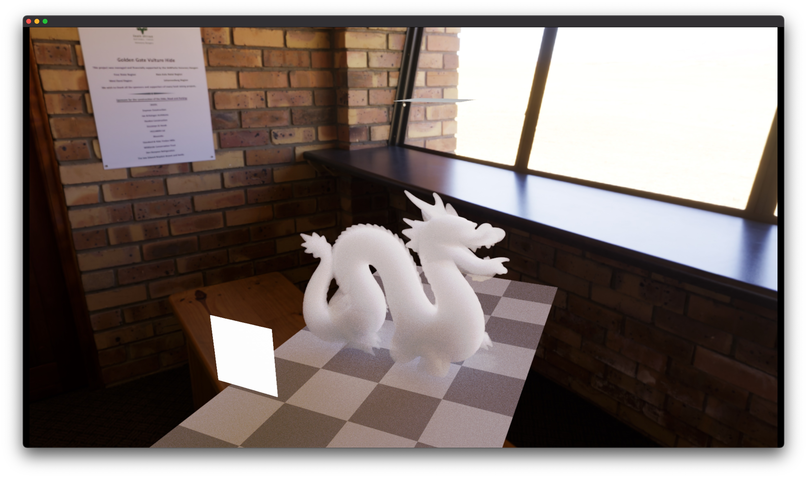
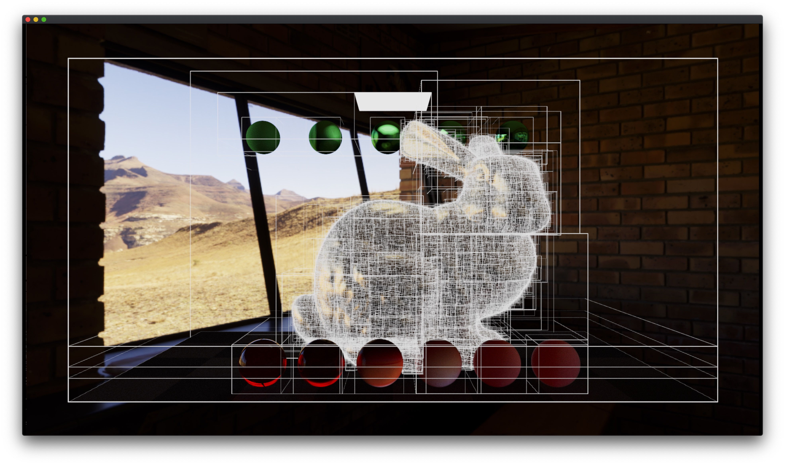
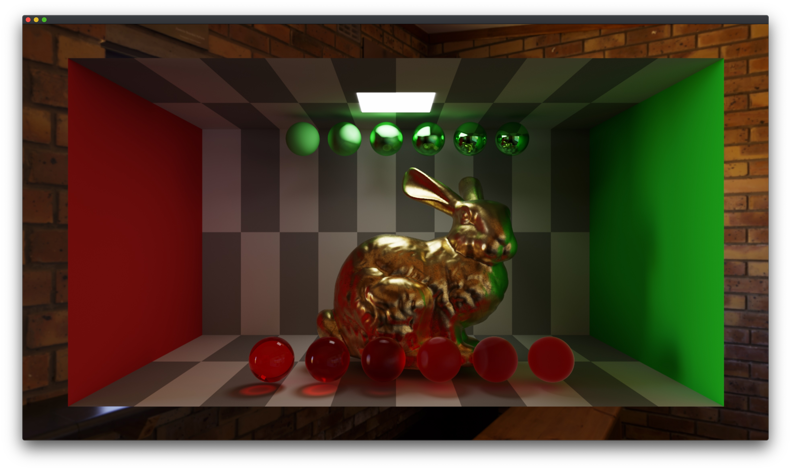
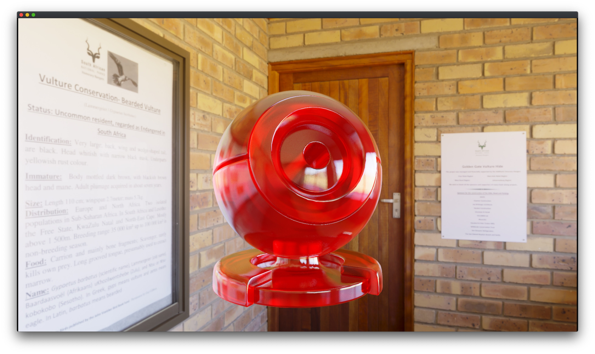

# Lǐ - PBRT on Metal
This is simply a repository for my **Ray Tracing** code.

# Requirement
RT_Metal requires `MTLArgumentBuffersTier2` device, for example AMD dGPU & eGPU. 

*`Not tested on Apple Silicon.`*

It may work on macOS 10.15. For compatibility, I am avoiding using new APIs added since macOS 11.

|                             |                             |
|:---------------------------:|:---------------------------:|
|  |  |
<!-- |                             |                             | -->

### Features:
- [ ] [Metal Kernel](https://developer.apple.com/documentation/metal)
    - [ ] MPSRayIntersector & MPSSVGF
    - [ ] FidelityFX Super Resolution 2.0
    - [x] GPUSPPM by Toshiya Hachisuka
        - [x] Parallel Reduction
        - [x] Spatial Hash Grids
    - [x] Stackless BVH traversal on GPU
    - [x] Bindless resources
    - [x] ACES tone, Auto exposure
    - [x] pcg-random
    - [ ] Blue noise
- [ ] [Ray Tracing Gems](https://www.realtimerendering.com/raytracinggems/)
    - [x] A Fast and Robust Method for Avoiding Self-Intersection
- [ ] [**Physically Based Rendering,** __*Third Edition*__](http://www.pbr-book.org/)
    - [ ] Halton Sampler
    - [x] Sobol’ Sampler
    - [ ] ***BVH*** 
        - [x] SAH, Parallel recursion
        - [ ] LBVHs, Morton Encoding
    - [x] Microfacet
        - [x] Beckmann
        - [x] TrowbridgeReitz
    - [ ] IEEE 754 float rounding error
    - [x] Multiple importance sampling
    - [ ] Ray Differential
    - [ ] Infinite Area Lights
    - [ ] Volume Rendering
        - [x] Homogeneous Medium
        - [x] Heterogeneous Medium
        - [ ] BSSRDF
    - [x] Stochastic Progressive Photon Mapping
    - [ ] Bidirectional Path Tracing
    - [ ] Metropolis Light Transport
    - [ ] Support pbrt-v3 file format 

### Other things to-do:
- [ ] Basic GUI & Menu
- [ ] Export as PNG file
- [ ] Cancelable tasks 
- [x] Quaternion camera

 ### References:  
- [x] [PCG Random](https://github.com/imneme/pcg-c-basic)
- [x] [mini PBRT parser](https://github.com/vilya/minipbrt)
- [ ] [TU Wien Rendering](https://www.cg.tuwien.ac.at/courses/Rendering/VU.SS2020.html)
- [ ] [Dartmouth Rendering Algorithms](https://cs87-dartmouth.github.io/syllabus/)
- [x] [Ray Tracing mini books by Peter Shirley](https://raytracing.github.io/)
- [ ] [Eric Veach, Ph.D. dissertation, December 1997](http://graphics.stanford.edu/papers/veach_thesis/)
